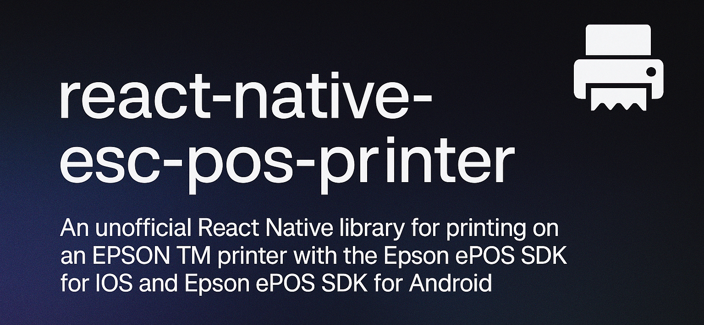

<p align="center">
  
</p>

|  [](https://badge.fury.io/js/react-native-esc-pos-printer)  |
|---|

## Features
 - Supports **BLE, LAN, USB** and **Wi-Fi** connection methods
 - Print receipts natively and from React Native views
 - Compatible with the **new architecture**
 - Build-in **queue mechanism**
 - **Clear errors descriptions**
 - Proxy-like API makes it **easy to add new commands**


## Installation

### React Native

> [!WARNING]  
> For react-native lower than 0.76.x version, use react-native-esc-pos-printer 4.3.3 or lower

```sh
yarn add react-native-esc-pos-printer
```

### Expo

```sh
npx expo install react-native-esc-pos-printer
npx expo prebuild
```

### Also complete [this required steps](./docs/INSTALLATION.md)

## Usage

### Discover printers

```tsx
import { usePrintersDiscovery } from 'react-native-esc-pos-printer';

function App() {
  const { start, isDiscovering, printers } =
    usePrintersDiscovery();

    useEffect(() => {
      start();
    }, []);
}
```

### Print

```tsx
import { Printer } from 'react-native-esc-pos-printer';

function App() {
  const { start, isDiscovering, printers } =
    usePrintersDiscovery();

    useEffect(() => {
      start();
    }, []);

    const print = () => {
      // printing on all discovered printers
      printers.forEach(printersData => {
          const printerInstance = new Printer({
            target: printersData.target,
            deviceName: printersData.deviceName,
          });

          const res = await printerInstance.addQueueTask(async () => {
            await Printer.tryToConnectUntil(
              printerInstance,
              (status) => status.online.statusCode === PrinterConstants.TRUE
            );
            await printerInstance.addText('DUDE!');
            await printerInstance.addFeedLine();
            await printerInstance.addCut();
            const result = await printerInstance.sendData();
            await printerInstance.disconnect();
            return result;
        })
      })
  }

  return <Button title="Print" onPress={print} />;
}

```

## Documentation
1. [Discovery API](./docs/discovery/discovery.md)
2. [Printer API](./docs/printer/Printer.md)
3. [Examples](./docs/QUICK_START.md)
4. [Supported devices](./docs/SUPPORTED_DEVICES.md)
5. [SDK information (v2.27.0)](./docs/SDK.md)

## Sponsor this project
If you like what I'm doing and want to support me, you can:

<p align="left">
  <a href="https://buymeacoffee.com/tr3v3r" target="_blank">
    
  </a>
</p>

## Known issues

1. It's not possible to print and discover on Android simulator.

2. If you have an issue with using Flipper on iOS real device, [try this](./docs/flipperWorkaround.md) workaround.

## License

MIT
