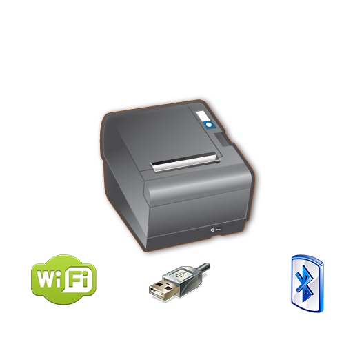

# EPSON ePOS SDK for React Native

_An unofficial React Native library for printing on an EPSON TM printer with the <strong>Epson ePOS SDK for iOS</strong> and <strong>Epson ePOS SDK for Android</strong>_

  

|    |
|---|

1. [Installation](./docs/INSTALLATION.md)
2. [API](./docs/API.md)
3. [Examples](./docs/QUICK_START.md)
4. [Supported devices](./docs/SUPPORTED_DEVICES.md)
5. [SDK information (v2.27.0)](./docs/SDK.md)

## Sponsoring
I'm working on the lib at my free time. If you like the lib and want to support me, you can [buy me a cofee](https://buymeacoffee.com/tr3v3r
). Thanks!

## Known issues

1. For now it's not possible to print and discover on Android simulator. But you can always use real device.

2. If you have an issue with using Flipper on iOS real device, please [try this](./docs/flipperWorkaround.md) workaround.

## Roadmap
- [ ] Add new architecture support
- [x] Add expo example
- [x] Add print from react View example
- [x] Reimplement discovering to have implementation close to native SDK
- [x] Reimplement printing to have implementation close to native SDK
- [x] Add queue mechanism for quick print

## License

MIT
