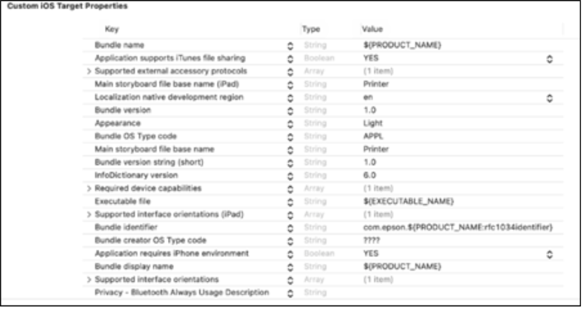

# Installation

- [Bare React Native](#bare-react-native)
- [Expo](#expo)


## Bare React Native

```sh
npm install react-native-esc-pos-printer
```

or

```sh
yarn add react-native-esc-pos-printer
```

### Android
Add the following permissions to `android/app/src/main/AndroidManifest.xml`

```xml
  <uses-permission android:name="android.permission.INTERNET" />

  <uses-permission android:name="android.permission.BLUETOOTH_SCAN"
      android:usesPermissionFlags="neverForLocation"/>
  <uses-permission android:name="android.permission.BLUETOOTH_CONNECT"/>

  <!-- Request legacy permissions on older devices. -->
  <uses-permission android:name="android.permission.BLUETOOTH"
      android:maxSdkVersion="30"/>
  <uses-permission android:name="android.permission.BLUETOOTH_ADMIN"
      android:maxSdkVersion="30"/>
  <uses-permission android:name="android.permission.ACCESS_FINE_LOCATION"
      android:maxSdkVersion="30"/>
  <uses-permission android:name="android.permission.ACCESS_COARSE_LOCATION"
      android:maxSdkVersion="28"/>
  <uses-permission android:name="android.permission.WRITE_EXTERNAL_STORAGE" android:maxSdkVersion="18"/>
  <uses-permission android:name="android.permission.READ_EXTERNAL_STORAGE" android:maxSdkVersion="18"/>
```

See explanation of permissions [here](./androidPermissions.md)

### iOS

```sh
pod install
```


#### Set the item in the Information Property List.
For iOS13 or later, add Privacy-Bluetooth Always Usage Description.
1. In Project Navigator, select *.plist. (The file name will be Project name-info.)
2. In the pop-up menu, select Add Row.
3. Select "Privacy-Bluetooth Always Usage Description".
4. Enter the intended use of Bluetooth in the "Value" field. (Example: Use this to communicate with the printer.)



##### When the Bluetooth or USB is used, set the protocol name. Set the protocol name according to the following procedure:

1. In Project Navigator, select *.plist. (The file name will be Project name-info.)
2. In the pop-up menu, select Add Row.
3. Select "Supported external accessory protocols".
4. Expand the items added in Step 3.
5. Enter com.epson.escpos as the Value for Item 0.


---
## Expo

```sh
npx expo install react-native-esc-pos-printer
npx expo prebuild
```

Modify `app.json`:

### Android
```JSON
{
  "android": {
    "permissions": [
     "android.permission.INTERNET",
     "android.permission.BLUETOOTH_SCAN",
     "android.permission.BLUETOOTH_CONNECT",
     "android.permission.BLUETOOTH",
     "android.permission.BLUETOOTH_ADMIN",
     "android.permission.ACCESS_FINE_LOCATION",
     "android.permission.ACCESS_COARSE_LOCATION",
     "android.permission.WRITE_EXTERNAL_STORAGE",
     "android.permission.READ_EXTERNAL_STORAGE"
     ]
  }
}
```

See explanation of permissions [here](./androidPermissions.md)

### iOS

```JSON
{
  "ios": {
    "infoPlist": {
      "NSBluetoothAlwaysUsageDescription": "Use this to communicate with the printer.",
      "UISupportedExternalAccessoryProtocols": ["com.epson.escpos"]
    }
  }
}
```
