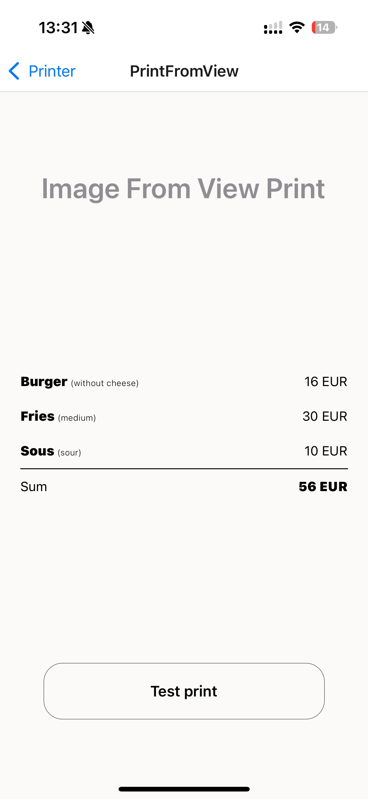

# Examples

## 1) Simple print

Please find full code [here](https://github.com/tr3v3r/react-native-esc-pos-printer/tree/main/example/src/screens/SimplePrint.tsx).

## 2) Print from React Native View

Please find full code [here](https://github.com/tr3v3r/react-native-esc-pos-printer/tree/main/example/src/screens/PrintFromView.tsx).
