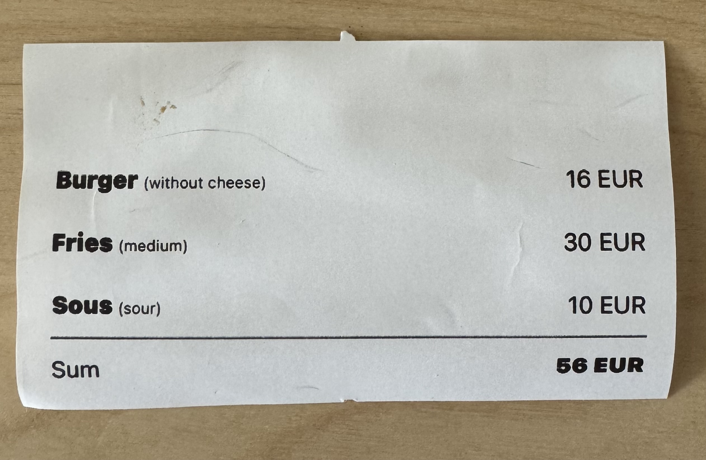

# Printer

Class that controls the printer connection and printing functions.

## [constructor](./constructor.md)

Initializes the printer object.

#### Example

```typescript
const printer = new Printer({
  target: "BT:00:22:15:7D:70:9C",
  deviceName: "TM-T88V",
})
```

## Methods

### connect()
*connect(`timeout?: string`): `Promise<void>`*

Starts communication with the printer.

**Example**

```typescript
await printerInstance.connect();
```
[Read more](./connect.md)

---

### disconnect()
*disconnect(): `Promise<void>`*

Ends communication with the printer.

**Example**

```typescript
await printerInstance.disconnect();
```
[Read more](./disconnect.md)

---

### addText()
*addText(`text: string`): `Promise<void>`*

Adds a character print command to the command buffer.

**Example**

```typescript
await printerInstance.addText("Hello, World!");
```
[Read more](./addText.md)

---

### addFeedLine()
*addFeedLine(`line?: number`): `Promise<void>`*

Adds a paper-feed-by-line command to the command buffer.

**Example**

```typescript
await printerInstance.addFeedLine(3);
```
[Read more](./addFeedLine.md)

---

### addLineSpace()
*addLineSpace(`linespc: number`): `Promise<void>`*

Adds line spacing setting to the command buffer.

**Example**

```typescript
await printerInstance.addLineSpace(50);
```
[Read more](./addLineSpace.md)

---

### sendData()
*sendData(`timeout?: number`): `Promise<PrinterStatusResponse>`*

Sends the print command.

**Example**

```typescript
const printerStatus = await printerInstance.sendData();
```
[Read more](./sendData.md)

---

### addCut()
*addCut(`type?: AddCutTypeParam`): `Promise<void>`*

Adds a sheet cut command to the command buffer.
Sets how to cut paper.

**Example**

```typescript
await printerInstance.addCut(PrinterConstants.CUT_NO_FEED);
```
[Read more](./addCut.md)

---

### getPrinterSetting()
*getPrinterSetting(`type: PrinterGetSettingsType, timeout?: number`): `Promise<PrinterSettingsResponse>`*

Acquires the set value of the printer setting.
The value acquired by this API is notified to the listener method specified in the listener parameter.

**Example**

```typescript
const printerSetting = await printerInstance.getPrinterSetting(PrinterConstants.PRINTER_SETTING_PAPERWIDTH);
```
[Read more](./getPrinterSetting.md)

---

### getStatus()
*getStatus(): `Promise<PrinterStatusResponse>`*

Acquires the current status information.

**Example**

```typescript
const printerStatus = await printerInstance.getStatus();
```
[Read more](./getStatus.md)

---

### addImage()
*addImage(params: AddImageParams): `Promise<void>`*

Adds a raster image print command to the command buffer.

**Example**

```typescript
await printerInstance.addImage({
  source: require('../store.png'),
  width: 100,
});
```
[Read more](./addImage.md)

---

### addBarcode()
*addBarcode(params: AddBarcodeParams): `Promise<void>`*

Adds a barcode print command to the command buffer.

**Example**

```typescript
await printerInstance.addBarcode({
  data: 'Test123',
  type: PrinterConstants.BARCODE_CODE93,
  hri: PrinterConstants.HRI_BELOW,
  width: 2,
  height: 50,
});
```
[Read more](./addBarcode.md)

---

### addSymbol()
*addSymbol(params: AddSymbolParams): `Promise<void>`*

Adds a 2D symbol print command to the command buffer.

**Example**

```typescript
await printerInstance.addSymbol({
  type: PrinterConstants.SYMBOL_QRCODE_MODEL_2,
  level: PrinterConstants.LEVEL_M,
  size: 5,
  data: 'Test123',
});
```
[Read more](./addSymbol.md)

---

### addCommand()
*addCommand(`data: Uint8Array`): `Promise<void>`*

Adds a command to the command buffer. Sends the ESC/POS command.

**Example**

```typescript
import EscPosEncoder from 'esc-pos-encoder';

let encoder = new EscPosEncoder();

let result = encoder
    .initialize()
    .text('The quick brown fox jumps over the lazy dog')
    .newline()
    .qrcode('https://nielsleenheer.com')
    .encode(); // or any other way to get the Uint8Array

await printerInstance.addCommand(result);
```
[Read more](./addCommand.md)

---

### addPulse()
*addPulse(`params?: AddPulseParams`): `Promise<void>`*

Adds a drawer kick command to the command buffer. Sets the drawer kick.

**Example**

```typescript
await printerInstance.addPulse();
```
[Read more](./addPulse.md)

---

### addTextAlign()
*addTextAlign(`params?: AddTextAlignParam`): `Promise<void>`*

Adds a text alignment command to the command buffer.

**Example**

```typescript
await printerInstance.addTextAlign(PrinterConstants.ALIGN_CENTER);
```
[Read more](./addTextAlign.md)

---

### addTextSize()
*addTextSize(`params?: AddTextSizeParams`): `Promise<void>`*

Adds character scaling factor setting to the command buffer.

**Example**

```typescript
await printerInstance.addTextSize({
  width: 2,
  height: 2,
});
```
[Read more](./addTextSize.md)

---

### addTextSmooth()
*addTextSmooth(`params?: AddTextSmoothParam`): `Promise<void>`*

Adds smoothing setting to the command buffer.

**Example**

```typescript
await printerInstance.addTextSmooth(PrinterConstants.TRUE);
```
[Read more](./addTextSmooth.md)

---

### addTextStyle()
*addTextStyle(`params?: AddTextStyleParams`): `Promise<void>`*

Adds character style setting to the command buffer.

**Example**

```typescript
await printerInstance.addTextStyle({
  em: PrinterConstants.TRUE,
  ul: PrinterConstants.TRUE,
  color: PrinterConstants.PARAM_UNSPECIFIED,
} as const);
```
[Read more](./addTextStyle.md)

---

### addTextLang()
*addTextLang(`lang: AddTextLangParam`): `Promise<void>`*

Adds language setting to the command buffer.
A text string specified by the [addText](./addText.md) API is encoded according to the language specified by this API.

**Example**

```typescript
await printerInstance.addTextLang(PrinterConstants.LANG_JA);
```
[Read more](./addTextLang.md)

---

### clearCommandBuffer()
*clearCommandBuffer(): `Promise<void>`*

Clears the command buffer.

**Example**

```typescript
await printerInstance.clearCommandBuffer();
```

---

## Static Methods

### Printer.addTextLine()
*Printer.addTextLine(`printerInstance: Printer, params: AddTextLineParams`): `Promise<void>`*

Prints text line with left and right parts.

**Example**

```typescript
await Printer.addTextLine(printerInstance, {
  left: 'Cheesburger',
  right: '3 EUR',
  gapSymbol: '_',
});
```
[Read more](./addTextLine.md)

---

### Printer.monitorPrinter()
*Printer.monitorPrinter(`printerInstance: Printer, listener: Listener, interval: number`): () => void*

Starts monitoring the printer status.

**Example**

```typescript
const stop = Printer.monitorPrinter(printerInstance, (status) => {
  console.log(status);
});

// call stop() to stop monitoring
```
[Read more](./monitorPrinter.md)

---

### Printer.tryToConnectUntil()
*Printer.tryToConnectUntil(`printerInstance: Printer, condition: (status: PrinterStatusResponse) => boolean`): `Promise<void>`*

Tries to connect to the printer until the condition is met.

**Example**

```typescript
await Printer.tryToConnectUntil(
  printerInstance,
  (status) => status.online.statusCode === PrinterConstants.TRUE
);
```
[Read more](./tryToConnectUntil.md)

---

### Printer.addViewShot()
*Printer.addViewShot(`printerInstance: Printer, params: AddViewShotParams`): `Promise<void>`*

Prints image captured from React Native View.

Requires `react-native-view-shot` to be installed.

```bash
yarn add react-native-view-shot
```

For iOS, run:

```bash
cd ios && pod install
```

**Example**

```typescript
const ref = useRef<View>(null);

...

await Printer.addViewShot(printerInstance, {
  viewNode: ref.current,
});

...

return (
  <View ref={ref}>
    <Text>Print me</Text>
  </View>
);
```




[Read more](./addViewShot.md)
